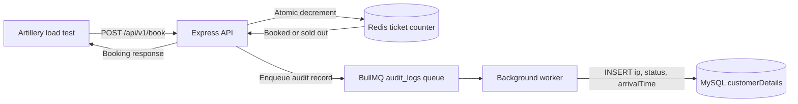

# ResourceRush

ResourceRush is a ticket-booking backend built with Express, Redis, BullMQ, and MySQL. Redis atomically tracks the remaining ticket count, while BullMQ sends booking audit records to a background worker for insertion into MySQL.

## Architecture



The API responds after the booking decision and queue submission. MySQL persistence happens asynchronously in the worker. Both successful bookings and sold-out attempts are queued for audit logging.

## Requirements

- Node.js and npm
- Docker with Docker Compose
- A running MySQL server

## Setup

Run commands from the `backend` directory:

```powershell
npm install
docker compose up -d
```

Docker Compose starts Redis in a container named `local-redis`, exposed on port `6379`. MySQL is not included in Docker Compose; start your MySQL server separately.

Create `backend/.env` with values for your local setup. This file is ignored by Git; do not commit database credentials.

```dotenv
DB_HOST=localhost
DB_USER=root
DB_PASSWORD=your_mysql_password
DB_NAME=resourcerush
DB_PORT=3306

PORT=3000

REDIS_HOST=localhost
REDIS_PORT=6379

# Use a time in the past for local testing. The value is parsed as a UTC date.
BOOK_START_TIME=2020-01-01T00:00:00Z
```

Create the database and table in MySQL:

```sql
CREATE DATABASE IF NOT EXISTS resourcerush;
USE resourcerush;

CREATE TABLE IF NOT EXISTS customerDetails (
	id INT PRIMARY KEY AUTO_INCREMENT,
	ip VARCHAR(45) NOT NULL,
	status ENUM('booked', 'sold out') NOT NULL,
	arrivalTime VARCHAR(50) NOT NULL,
	created_at TIMESTAMP DEFAULT CURRENT_TIMESTAMP
);
```

The database and table names, column names, and status values must match the worker's `INSERT` query.

## Run

Open separate terminals in the `backend` directory.

Start the API:

```powershell
npm run dev
```

Start the background worker:

```powershell
npm run worker
```

The worker must remain running to consume queued audit records and save them to MySQL. It prints an insert success message after MySQL confirms an insert; failed jobs are reported in the worker terminal.

## Set Ticket Count

Initialize or reset the Redis counter with the npm shortcut:

```powershell
npm run set-tickets -- 30
```

Replace `30` with the desired ticket count. Redis should respond with `OK`. To inspect the value directly:

```powershell
docker exec -it local-redis redis-cli GET tickets
```

Reset the counter before each load-test run if you need a fresh ticket pool.

## API

The booking endpoint is:

```http
POST http://localhost:3000/api/v1/book
```

It does not require a request body. It returns a booking-success or sold-out response. Requests before `BOOK_START_TIME` receive HTTP 403 and are not queued.

PowerShell smoke test:

```powershell
Invoke-RestMethod -Method Post -Uri http://localhost:3000/api/v1/book
```

## Load Test

The included Artillery scenario sends 200 requests per second for five seconds to the booking endpoint:

```powershell
npm run load-test
```

The configured run creates approximately 1,000 requests. With a ticket count of 30, up to 30 requests can book tickets; subsequent requests receive the sold-out response. The endpoint returns HTTP 200 for both booked and sold-out results, so inspect the response body and database rows as well as Artillery's HTTP status metrics.

## Verify MySQL Records

```sql
USE resourcerush;
SELECT id, ip, status, arrivalTime, created_at
FROM customerDetails
ORDER BY id DESC;
```

The API's response does not mean the MySQL insert has already completed. Check the worker terminal for `Data inserted into database successfully.` or a job failure message.

To delete all records, run this only when you intend to clear the table:

```sql
TRUNCATE TABLE customerDetails;
```

## Troubleshooting

- **Booking returns HTTP 403:** `BOOK_START_TIME` is still in the future. Set it to a past UTC timestamp for local tests and restart the API so it reloads `.env`.
- **No worker output after a request:** Confirm `npm run worker` is running from `backend`, then send a new request that is not blocked by the start-time check.
- **Queue jobs fail:** Read the failure reason in the worker terminal. Check that job data has `ip`, `status`, and `arrivalTime`, and that the MySQL table schema matches this README.
- **No MySQL rows:** Confirm the worker is running, the job completed successfully, and `DB_HOST`, `DB_USER`, `DB_PASSWORD`, `DB_NAME`, and `DB_PORT` point to the intended MySQL instance.
- **Redis connection errors:** Start the Redis container with `docker compose up -d` and verify `REDIS_HOST` and `REDIS_PORT`.
- **A load test reports HTTP 200 but no ticket was booked:** Sold-out requests also return HTTP 200. Check the response body and Redis counter.
